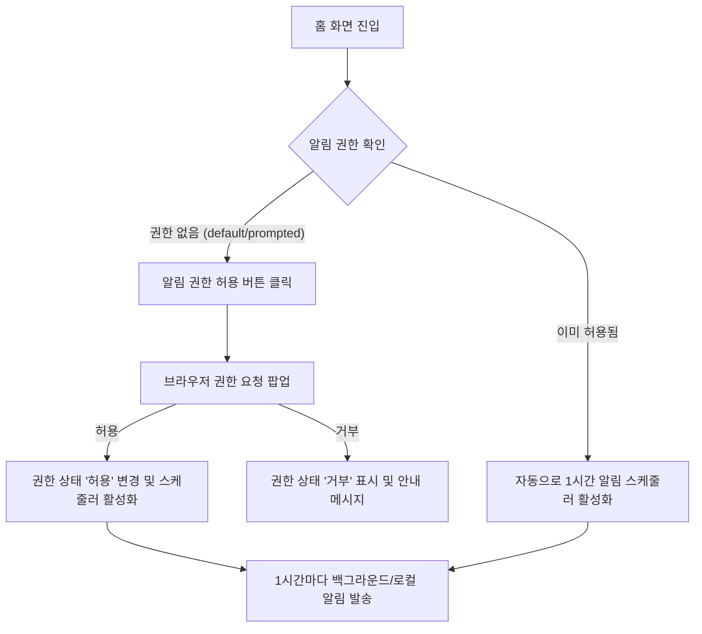

# User Flow: PWA 웹 푸쉬 / 알림 기능 (U01)

## 🎯 목적
사용자에게 정기적으로 "화이팅 만마에!"라는 응원 로컬 알림을 발송하여 긍정적이고 자신감 넘치는 마인드셋을 가질 수 있도록 유도합니다.

## 🔗 관련 요구사항 (RTM 추적)
- **P01**: 홈 화면
- **F01**: 알림 권한 요청 및 상태 표시
- **F02**: 즉시 테스트 알림 발송 ("화이팅 만마에!")
- **F03**: 1시간 주기 응원 알림 스케줄링

## 🔄 사용자 흐름 (Mermaid Diagram)

### 1. 알림 권한 허용 및 스케줄러 흐름 (Flowchart)


### 2. 알림 발송 흐름 (Sequence Diagram)
```mermaid
sequenceDiagram
    participant User as 사용자
    participant Front as 프론트엔드 (Next.js)
    participant SW as 서비스 워커 (Service Worker)
    participant OS as 브라우저/OS 알림 시스템
    
    User->>Front: 알림 권한 허용
    Front->>SW: 서비스 워커 스케줄러 등록
    
    rect rgb(240, 240, 240)
        Note over Front, SW: 1시간 간격 또는 즉시 테스트 버튼 클릭
        Front->>SW: 알림 발송 요청 (포그라운드)
        OR
        SW->>SW: 백그라운드 주기적 트리거 (스케줄러)
        SW->>OS: showNotification("화이팅 만마에!") 호출
        OS->>User: 알림 카드 노출 ("화이팅 만마에!")
    end
```

## 📝 BDD 시나리오 참조
구체적인 동작 명세(Given/When/Then)는 다음 파일을 참조하십시오:
- [docs/user-flow/push_notification.feature](file:///Users/gimjaeman/Desktop/coding/mannlab/dimmer-switch/docs/user-flow/push_notification.feature)
