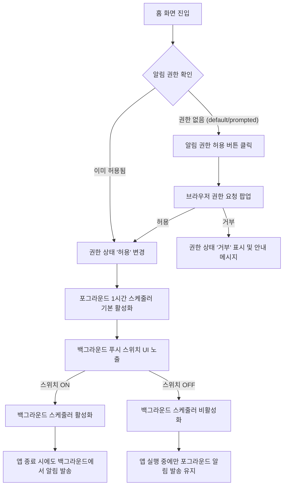
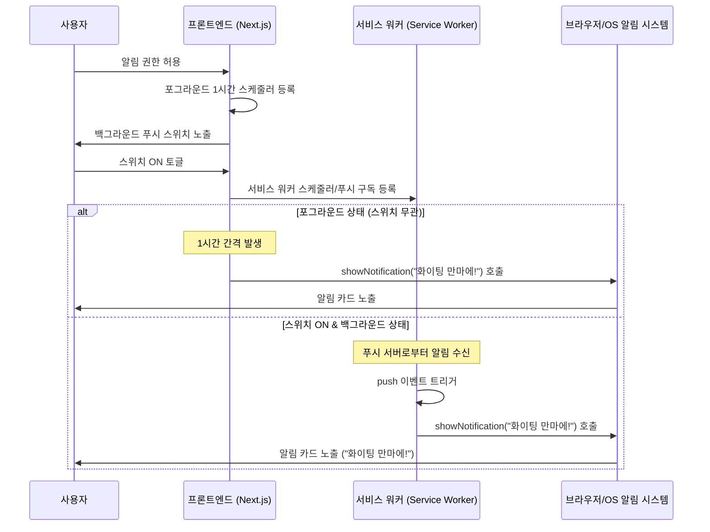

# User Flow: PWA 웹 푸쉬 / 알림 기능 (U01)

## 🎯 목적
사용자에게 정기적으로 "화이팅 만마에!"라는 응원 로컬 알림을 발송하여 긍정적이고 자신감 넘치는 마인드셋을 가질 수 있도록 유도합니다.
> **타겟 환경 명시**: 본 서비스는 사용자의 주 기기인 **iPhone Xs (iOS)** 환경에 최적화되어 동작해야 합니다. 앱 종료 시 백그라운드 푸시를 위해서는 기기의 "홈 화면에 추가"가 필수적입니다.

## 🔗 관련 요구사항 (RTM 추적)
- **P01**: 홈 화면
- **F01**: 알림 권한 요청 및 상태 표시
- **F02**: 즉시 테스트 알림 발송 ("화이팅 만마에!")
- **F03**: 1시간 주기 응원 알림 스케줄링
- **F04**: 백그라운드 푸시 켜기/끄기 스위치 UI 제공

## 🔄 사용자 흐름 (Mermaid Diagram)

### 1. 알림 권한 허용 및 스케줄러 흐름 (Flowchart)

### 2. 알림 발송 흐름 (Sequence Diagram)

## 📝 BDD 시나리오 참조
구체적인 동작 명세(Given/When/Then)는 다음 파일을 참조하십시오:
- [docs/user-flow/push_notification.feature](file:///Users/gimjaeman/Desktop/coding/mannlab/dimmer-switch/docs/user-flow/push_notification.feature)
